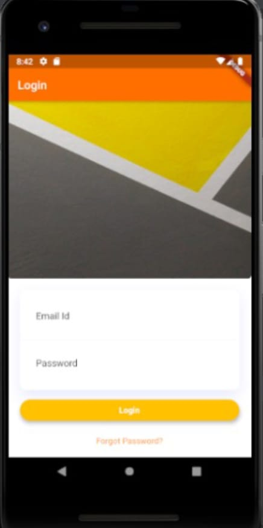

# loginsecretpage

A new Flutter application.

## Getting Started

When initially opened, it will ask for login credentials, remember to type in the following credentials 
email = abdeshmukh@gmail.com 
password = abdeshmukh

logout buton on the secret page will take you back to the login page.

"When a person logs in to the system using any assumed credentials from your end, every time
the app is opened even after clearing the app from recent apps it should go to the secret page.
The secret page should have a logout button which when pressed logs the person out, from now
on every time the person opens the app login screen should open.
Hint : Think of it as a login module without the backend. You are free to use any way to maintain
the data locally." 
The above functionality has been implemented successfully. 

## Login

# Home Page 

